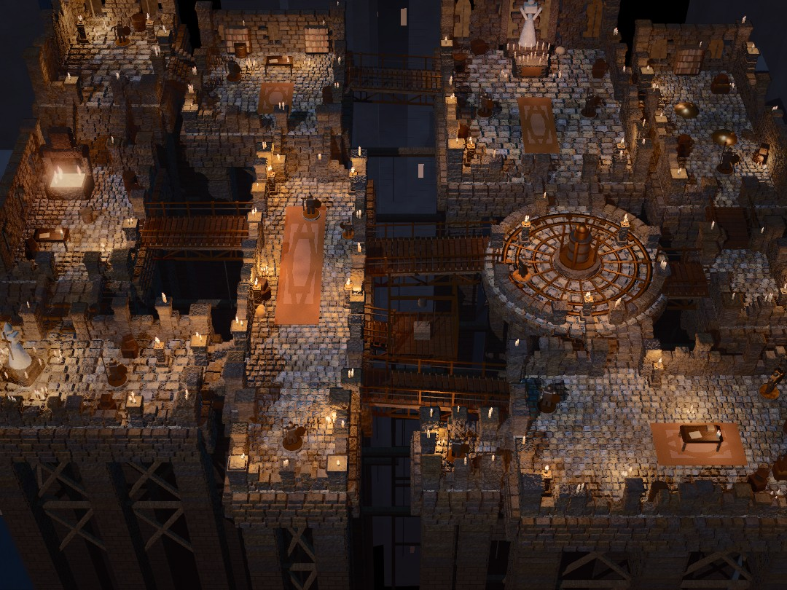
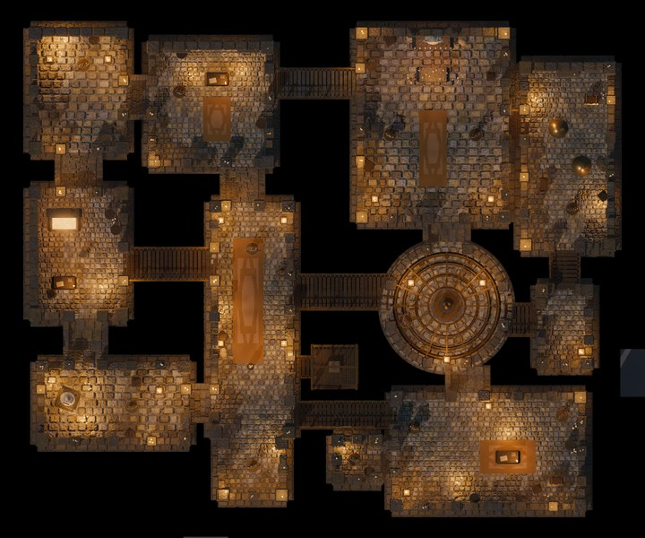

# Sky Keep

A small playable Godot 4.7 game whose default view matches `reference/reference.png`:
a candle-lit stone keep of platforms on tall pillars over a dark abyss, joined by
plank bridges and stairs. All geometry and materials are generated in code and
shaders. Nothing is downloaded.



## Running

Requirements: Godot 4.7 on `PATH` (or `GODOT_BIN`), plus Python 3 with
`numpy` and `pillow` for the tools (`pip install -r tools/requirements.txt`).
Without a GPU, install `mesa-vulkan-drivers` so Godot runs Forward+ on
llvmpipe. Without a display, `run_game.sh` wraps captures in `xvfb-run`.

```sh
./run_game.sh                       # play
./run_game.sh --check               # headless: every walkable cell reachable from spawn
./run_game.sh --walktest            # headless: walk the player's own movement code to every room
./run_game.sh --inputtest           # feed key events: walk, orbit, reset camera
./run_game.sh --topdown=out.png     # orthographic top-down audit render
./run_game.sh --capture=out.png --lut=off --size=1080x810
xvfb-run -a -s "-screen 0 1920x1080x24" python3 tools/match.py --tag NAME
```

The game accepts the user arguments that `tools/match.py` passes after `--`:
`--capture=PATH --lut=off|auto --frames=N --size=WxH --seed=N --vignette=F
--cam=yaw,pitch,dist,fov[,fx,fy,fz]`. It renders into a SubViewport of exactly
`--size`, writes the PNG and quits. With `--lut=auto`, the final canvas pass
applies the vignette and then `godot/luts/00_reference_match.cube` as a
display-sRGB 3D LUT. Its output matches `fit_lut.apply_lut` on the raw capture
to within 0.002 mean absolute error.

## Controls

| Key | Action |
| --- | --- |
| W A S D / arrows | walk (relative to the camera), Shift to run |
| Right-drag, Q / E | orbit |
| Z / X | tilt |
| Mouse wheel, + / - | zoom |
| F | toggle following the player |
| R | reset to the matched reference view |

## How the reference was read

- **Camera:** a high oblique view looking north. I fitted it by back-projecting
  each room's pixel box from the reference onto its floor plane, then overlaying
  the solved layout on the reference. The result is yaw 0°, pitch 45°, distance
  56 m, vertical FOV 30°, focus at the origin.
- **Big shapes:** thirteen stone room-platforms in three loose rows over a void.
  - Far row: the raised keep with stairs, the study, the shrine with a statue in
    a gothic alcove, and the treasury.
  - Middle row: the forge, the long carpeted nave, the round bronze orrery dais,
    and a small landing.
  - Near row: the chapel with a large statue, the nave's pier, a hanging lift,
    the great hall, and a small dock.
- **Connections:** plank bridges with bronze rails and trusses, stone stairs
  between levels, and an iron bridge across the top gap. Every room stands on
  square stone pillars with timber X-bracing, running down into haze.
- **Materials:** cobbles and flagstones, block-built parapets with ruined tops
  and square posts, bronze, dark timber and red-brown carpets.
- **Light:** dozens of candles and a forge fire give warm orange pools. A soft
  warm key light and a cool fill come from the abyss side. About 94% of the
  saturated pixels are orange.

## Architecture

Pure GDScript. Nothing needs compiling.

- `scripts/layout.gd` is the declarative layout. Rooms are named rectangles or
  circles with a floor height, parapet heights per side and a floor type.
  Connections (`bridge`, `stairs`, `door`) name two rooms. `Layout.solve()`
  finds the facing sides, the overlap and the span itself, and fails loudly if:
  - two rooms overlap or only touch diagonally;
  - a strip doesn't fit the shared side between the parapets;
  - a door joins rooms that don't touch, or that sit at different heights;
  - a stair has no height change, or a bridge is too steep.

  So a path to nowhere can't be written. Circle rooms clip the span to the rim.
- `scripts/walk_grid.gd` is a 0.25 m grid of walkable cells with heights:
  room floors minus parapets, plus connection strips ramping between the two
  rooms. Props and wall clutter punch blocked circles into it. It provides BFS
  reachability, path finding and spawn selection.
- `scripts/builder.gd` builds the scene as real instanced geometry, about 15k
  instances in one MultiMesh per mesh/material pair, lit by 64 omni lights:
  - individual chamfered cobbles and flagstones;
  - masonry courses, crenellations, ruined wall tops and posts;
  - slab aprons and pillars with stacked blocks;
  - plank-by-plank bridges with railings and trusses;
  - stepped stairs, lower cross-ties and chains;
  - a backdrop of distant towers.
- `scripts/props.gd` builds the props from primitives: knights, statues, the
  shrine alcove, altar, orrery, forge hearth, desks, bookcases, barrels, crates,
  chests, gold and candles. It also places the omni lights.
- `shaders/` holds world-space procedural stone (bump, grime, worn chamfers),
  masonry, wood grain, tarnished metal, woven carpet, flame, glow, the backdrop,
  and `post.gdshader` (vignette and LUT).
- `scripts/main.gd` parses arguments and sets up the environment (AgX tonemap,
  height fog, SSAO, light glow without bloom), the camera, player, capture and
  self-tests. `orbit_camera.gd`, `player.gd` and `cube_lut.gd` are small helpers.

Supports: bridges rest on both rooms' slabs, and stairs sit on a masonry block.
The lift stands on a bronze frame, and lower ties anchor into pillars on both
sides. The top-down render (`--topdown`) confirms every connection has floor at
both ends:



## Score progress

Scores come from `tools/match.py` (unmodified): raw is the LUT off, graded is
the fitted LUT applied in-engine. Each row is one change, measured against the
row before it.

| Tag | Change | Raw | Graded |
| --- | --- | ---: | ---: |
| v01_baseline | first full scene, guessed camera | 57.7 | 69.6 |
| v04_layout | rooms and camera fitted by back-projecting the reference | 49.5 | 70.4 |
| v05_hues | wood, bronze and carpet moved from red toward orange | 53.0 | 73.5 |
| v07_spread | neutral stone with warm/cool per-block variation | 48.1 | 76.1 |
| v08_yellow | yellower lights | 59.6 | 76.4 |
| v11_hue50 | lights at hue 50° (reverted: red rose) | 39.2 | 72.2 |
| v12_towers | arched tower facades, clutter along walls | 57.2 | 73.9 |
| v14_agx | Filmic to AgX tonemapper (Filmic's toe reddened the darks) | 49.5 | 81.3 |
| v15_exposure | exposure 1.6, so the LUT curve flattens | 58.6 | 80.2 |
| v18_candle_yellow | neutral key light, saturated yellow-orange candles | 61.0 | 80.0 |
| v20_contrast | stronger SSAO, grime and per-tile variation | 59.4 | 82.2 |
| v22_teal | teal-leaning ambient (blue ambient pushed warm falloff to red) | 58.5 | 83.8 |
| v23_pillars | rooms on pillars with timber bracing instead of solid towers | 58.2 | 83.2 |
| v24_layoutfix | forge, treasury, landing, lift and dock re-fitted to the reference | 56.9 | 83.4 |
| v25_glow | bloom 0.08 (reverted: it lifted the darks) | 55.3 | 77.5 |
| v26_glow2 | glow without bloom, warmer and larger flames, lower cross-ties | 58.9 | 87.3 |
| v29_warmdark | warm fog and background, so the darks are brown like the reference | 57.4 | 88.2 |
| **final** | current scene, LUT committed | **57.4** | **88.2** |

Final metrics: lightness EMD 0.0039, band tint 0.0038, hue mix 0.023,
local contrast ×0.90, detail ×1.04. The fitted lightness curve is mild
(0.40→0.44, 0.50→0.57). The chroma scale still sits near the fitter's 1.8×
limit: the render's colour spread within each lightness band is narrower than
the reference's.

## Known gaps

- `compare.py` ignores composition. By eye, the reference has more broken
  masonry, richer props and deeper visible voids between the near towers than
  this scene.
- Captures take about 60 s each on llvmpipe, mostly startup and shader
  compilation.
