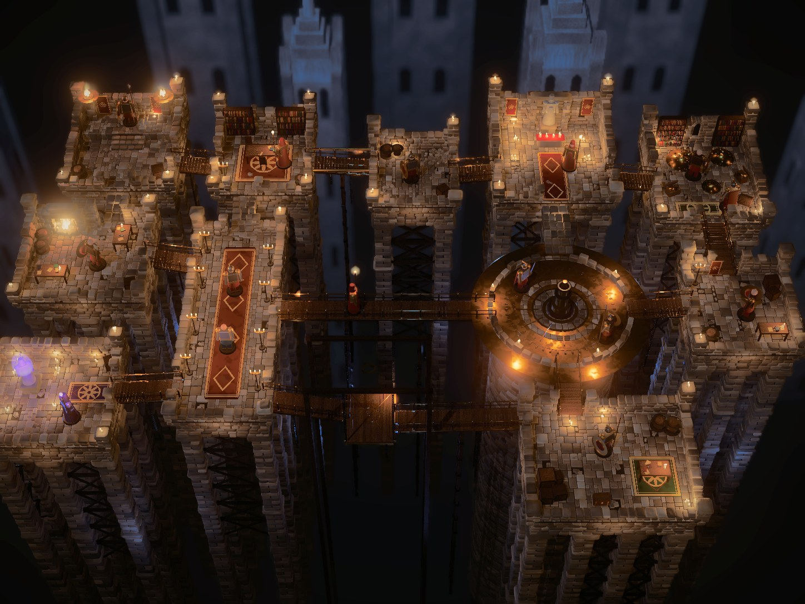

# Reference Test



A visual-fidelity experiment: how close a Godot + Rust game can get to a single
reference image, a candle-lit fantasy dungeon diorama of rooms on masonry piers
above a blue abyss, joined by timber and brass bridges. Everything is
procedural: no models, no textures, only code and shaders. The tools in
`tools/` score each render against the reference and fit a colour-grade LUT to
close the remaining gap.

The reference image is not included (see [Reference image](#reference-image)).
The game runs without it.

## How it works

- **Rust** (`src/`, no dependencies) generates the seeded diorama: every stone,
  plank, prop, figure and light. It also owns the walk grid and player movement,
  and runs headlessly.
- **Godot 4.7** (`godot/`, Forward+) only presents the result. It turns Rust's
  packed buffers into chunked MultiMeshes with procedural material shaders, then
  draws lights, fog, SSAO/SSIL, glow and depth of field. A final canvas pass
  applies the colour-grade LUT.
- **Adapter**: `godot_bridge/` is the gdext 0.5.5 binding (`PlatformsBridge`).

## Requirements

- Linux x86_64 (the `.gdextension` only lists a Linux library so far)
- [Godot 4.7](https://godotengine.org/) on `PATH` as `godot`, or set `GODOT_BIN`
- Rust 1.85+ (edition 2024)
- For `tools/`: Python 3 with `pip install -r tools/requirements.txt`, a
  display (captures run the real renderer), and a reference image

## Run

```sh
./run_game.sh                 # build the extension and play
./run_game.sh --build-only    # build/copy the extension only
./target/release/platforms-test [--seed N] [--walk TICKS]   # headless stats + reachability
```

Godot user arguments follow a second `--`, e.g.
`./run_game.sh -- -- --seed=3 --lut=off --compare=1` (the first `--` ends the
script's own options). See `./run_game.sh --help`.

| Control | Action |
| --- | --- |
| WASD / arrows | Move the hero (camera-relative) |
| RMB drag / MMB drag / wheel | Orbit / pan / zoom |
| F | Follow the hero |
| L | Cycle LUT (OFF → profiles in `godot/luts`, `user://luts`) |
| `[` `]` | LUT strength |
| Tab | Compare: off / split (drag LMB to move the divider) / reference only (needs a reference image) |
| Home / F12 / F1 / F11 | Reset camera / screenshot / HUD / fullscreen |

## Reference image

The reference was used for private study and is not redistributed here. To
run the matching loop, put any target image at `reference/reference.png`; its
size sets the capture size. The shipped `godot/luts/00_reference_match.cube`
is the grade fitted to the original reference, so the game looks as in the
screenshot out of the box. `tools/match.py` overwrites it with a fit to your
image.

## Matching the reference

The colour grade is a 3D `.cube` LUT, applied in display sRGB after tonemapping.
`godot/color_lut.gd` loads `.cube` files. `tools/` closes the loop
between render and reference:

```sh
tools/match.py --tag try1        # capture raw → fit LUT → capture graded → score → sheet
tools/compare.py captures/x.png  # score any image against the reference
tools/fit_lut.py captures/raw.png --preview captures/predicted.png
```

- **`compare.py`** scores colour without depending on composition. It compares
  OKLab lightness and a/b histograms (EMD), tint and chroma per lightness band,
  and the hue mix of saturated pixels. Two structural ratios cover local
  contrast and fine detail. Everything folds into a 0–100 score.
- **`fit_lut.py`** fits a smoothed, slope-limited lightness histogram match,
  plus a per-band affine a/b transfer (split toning learned from the
  reference). It gamut-maps the result, bakes a 33³ cube to
  `godot/luts/00_reference_match.cube` (selected by default as `auto`) and
  predicts the graded score.
- **The in-engine LUT path is verified.** The engine's graded capture matches
  the Python prediction to under 1/255 mean difference.

Refit after any lighting, material or layout change: the LUT is fitted to the
current raw render. A large LUT correction means the scene is off; fix the scene
first and let the LUT finish the grade.

Progress (seed 7, 1448×1086, default camera):

| Stage | Raw | Graded |
| --- | --- | --- |
| First render | 0 | – |
| Warm light, haze, irregular flagstones, figures and props ×1.45 | 25.6 | – |
| First LUT fit | 29.7 | 69.4 |
| Rooms on piers, timber bracing, gothic backdrop, clutter (vignette on) | 20.7 | **68.2** |

The remaining penalty is mostly structural: local contrast is ×0.64 and fine
detail ×0.68 of the reference. Next targets, in order:
- more detailed miniature figures (current ones are blocky stand-ins)
- denser clutter and wall dressing
- more vertical layering (upper decks, stairs)
- warm-lit timber frames and blue-lit gothic structures in the abyss

## Layout

- `src/layout.rs`: authored macro layout (10 rooms, round mechanism platform,
  hanging lift, 12 bridges, backdrop). The seed varies all detail.
- `src/kit.rs`: masonry, flagstones, slab-on-pier supports, bridges, trestles,
  chains, and the scoped `prop_scale` that enlarges furniture and figures.
- `src/props.rs`: furniture, candles and fire (with lights), treasure, carpets,
  banners, clutter and painted miniature figures.
- `src/mesh.rs`: base meshes (rough stones, flagstones, rounded box, lathed
  cylinder, barrel, cone, sphere, rings, flame).
- `godot/shaders/`: stone, wood, metal, gold, cloth, paint, wax, flame, glow,
  backdrop, finish (LUT, vignette, compare).

## Development notes

This project was built with an AI coding agent. `AGENTS.md` holds the working
rules it follows, and they apply to human contributors too: keep the Rust core
dependency-free and headless, and run `cargo run --release` (every room
reachable) and `cargo test --release` after changing geometry.

## License

Licensed under either of [MIT](LICENSE-MIT) or [Apache-2.0](LICENSE-APACHE), at
your option. Contributions are accepted under the same terms.
