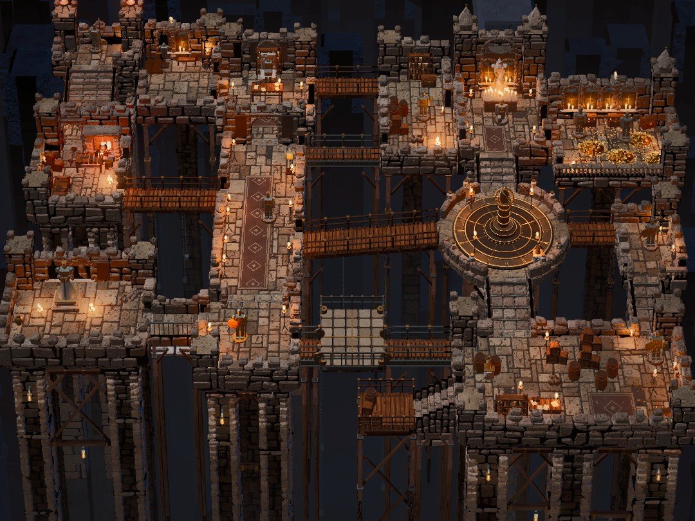

# Abyssal Keep

A small playable Godot 4.7 game whose default view is matched to
`reference/reference.png`: a candle-lit floating dungeon of stone rooms,
bridges and stairs on tall pillars over a dark shaft. Nothing is downloaded.
Every block, flagstone, plank, chain link, coin and statue is generated in
code and instanced, and every material is a procedural shader.



The reference image itself is not in the repository. Put it at
`reference/reference.png`; everything that measures or grades reads it from
there, at whatever size it has.

## Running

Requirements:

- Godot 4.7 on `PATH` as `godot`, or set `GODOT_BIN`.
- On a machine without a GPU, install `mesa-vulkan-drivers` so Godot runs
  Forward+ on lavapipe (without it Godot falls back to OpenGL). Use `Xvfb` /
  `xvfb-run` for captures when there is no display.
- Python 3 with `tools/requirements.txt` (numpy, pillow) for the matching tools.

```sh
./run_game.sh --build-only   # import once (builds Godot's class cache)
./run_game.sh                # play
./run_game.sh --check        # headless layout + reachability check, exit 1 on failure
./run_game.sh -- --cam=20,50,60,30   # play from another starting view

# Score the matched view and refit the LUT (needs a display):
xvfb-run -a -s "-screen 0 1920x1080x24" python3 tools/match.py --tag NAME
```

The game reads the user arguments that `tools/match.py` passes:
`--capture=PATH` (render, save the PNG, quit), `--lut=off|auto`,
`--frames=N` (frames to render before the capture), `--size=WxH`, `--seed=N`
(prop and masonry variation), `--vignette=F` and
`--cam=yaw,pitch,dist,fov[,fx,fy,fz[,keystone]]`. It also accepts `--check`
(headless report) and `--topdown` (plan view for verification).
With `--lut=auto`, `godot/luts/00_reference_match.cube` is applied as a
display-sRGB 3D LUT in the final screen pass, after the vignette, so the
graded capture is the LUT applied to the raw one.

## Controls

| key | action |
|---|---|
| WASD / arrows | walk the knight (camera-relative); Shift runs |
| right mouse drag, Q/E, Z/X | orbit, tilt |
| mouse wheel | zoom |
| middle mouse drag | pan |
| F | follow the knight |
| R | reset to the matched view |
| G | toggle the colour grade (LUT) |
| F1 | hide the help |

The knight walks only on the walk grid that the reachability check
flood-fills. It climbs stairs one step at a time and can't step off an edge or
through a wall or prop.

## Layout

The level is data (`godot/scripts/plan.gd`), read off the reference with the
same camera maths the game uses (`scripts/viewmath.py`, notes in
`docs/reference_study.md`):

- **16 rooms**, each a named plan rectangle (or circle) at a floor height:
  keep, rampart, gallery, study, forge, hall, landing, throne room, store,
  chapel, treasury, orrery, east wing, cellar, lift and low dock.
- **18 links**, each declared between two named rooms: doors, wooden bridges,
  a stone walkway, iron girders and stairs. `Layout.resolve()` works out
  which sides face each other, the gap, the cross-axis fit, the wall
  openings, the heights and the step count, and rejects any link that can't
  land on real floor at both ends: no shared floor, too steep, wrong tread
  depth, or off-centre on the round dais.
- **Props** are placed at fractions of a room's floor. They must stand on that
  floor and keep clear of every doorway and landing, and their footprints
  block the walk grid.
- **Supports** are part of the model: every room stands on corbelled,
  slender stone piers (and, under a south edge that overhangs a shaft, timber
  posts), or on timber posts alone (the dock), that reach the abyss floor. The lift
  hangs between two girders whose far ends stand on their own. Long spans get
  posts and trusses, and chains hang from bridges and the lift. Where two rooms
  touch, one wall stands on the shared edge and the other floor runs up to it.

`./run_game.sh --check` resolves the plan, builds the 0.25 m walk grid and
flood-fills it from the spawn. It prints every room and link with
reached/total cells, checks each link lands on its rooms' floors at matching
heights, and lists what holds each room up:

```
ok   room keep        ...  floor +1.6
ok   link stairs:keep-rampart           112/ 112 cells  gap  2.5 m  8 steps
...
support lift       carried by its girders between supported rooms
reachability: every walkable cell is reachable from the spawn in landing
```

The top-down render (`--topdown`) was used to confirm by eye that every
connection has floor at both ends and nothing floats:


### Code

| file | role |
|---|---|
| `godot/scripts/layout.gd` | rooms, links, props, shared walls, walk grid, reachability and support report |
| `godot/scripts/plan.gd` | the reference read as a level |
| `godot/scripts/build.gd` | flagstones, coursed walls, crenellations, towers, pillars, bridges, stairs, girders, trusses, chains |
| `godot/scripts/props.gd` | prop footprints and builders (statues, candles, gold, orrery, fireplace...) |
| `godot/scripts/kit.gd` | bevelled unit meshes, materials, MultiMesh batching |
| `godot/scripts/world.gd` | environment, sun, candle lights, abyss backdrop |
| `godot/scripts/rig.gd` | orbit camera with the shift-lens matched view |
| `godot/scripts/grade.gd`, `godot/shaders/post.gdshader` | vignette and display-sRGB LUT pass |
| `godot/scripts/player.gd` | the knight on the walk grid |
| `godot/shaders/*.gdshader` | stone, wood, metal, cloth, wax, flame, glow, void |
| `scripts/` | dev helpers: `viewmath.py` (project/unproject), `gridsheet.py`, `overlay.py`, `regions.py` |

## How the view was matched

- **Camera.** Pillars in the reference stay almost vertical, yet floors at
  the top are about 0.7x the scale of those at the bottom. The matched view is
  therefore a shift lens: the body pitches 24° and an off-centre frustum looks
  the rest of the way to 44°, through a 16° lens from 110 m. The orrery's
  ellipse unprojects to a circle at that pitch.
- **Sun.** The key light is a distant spotlight, not a DirectionalLight3D,
  because Godot fits directional shadow splits to a symmetric frustum and
  they miss part of the shifted view. Its shadow atlas is 32-bit: 16-bit depth
  at that distance put false shadow bands across the floors.
- **Darks.** The reference has true near-blacks in crevices and under the
  rooms. Bloom haze and depth fog lifted every black and made the fitted LUT
  lift the shadows, so bloom is off, joints and unlit openings are near-black
  recesses, and faces below the floors darken with depth before the abyss fog
  takes them.
- The LUT (`fit_lut.py`) is only the final grade. The last fitted curve stays
  within about ±0.04 of identity in lightness
  (`0.1→0.14 0.3→0.28 0.5→0.51 0.7→0.73`).

## Scores

`tools/match.py --tag NAME` (seed 7, 45 frames, vignette 0.25, 1080x810,
software Vulkan). Raw is the render with the LUT off. Graded is the in-engine
render with the freshly fitted LUT.

| tag | change | raw | graded |
|---|---|---|---|
| m01_baseline | first full scene: layout, masonry, props, Filmic | 30.1 | 77.2 |
| m02_masonry_light | chunkier masonry, multi-pillar supports, railings, chains, spotlight sun | 51.7 | 69.6 |
| m03_materials | metals no longer reflect a black void, neutral stone | 64.3 | 69.9 |
| m05_agx | AgX tonemapper, yellower candles (the grade was turning orange pools red) | 59.5 | 72.6 |
| m07_trusses_debris | trusses under links, floor debris, inner ring of abyss pillars | 66.0 | 77.5 |
| m08_shared_walls | one wall per shared edge, lower walls, north-west rooms re-measured | 59.2 | 76.5 |
| m10_deep_darks | depth fog nearly off, stronger SSAO | 75.5 | 76.4 |
| m11_dark_pillars | less ambient, abyss fog starts lower | 76.7 | 80.1 |
| m14_details | chapel windows, balustrades, gold heaps, orrery, lit chapel statue | 72.1 | 78.9 |
| m17_void | underside occlusion, near-black joints and openings | 76.5 | 79.0 |
| m18_no_bloom | bloom off (it lifted every black) | 73.1 | 86.5 |
| m19_clean_shadows | 32-bit shadow atlas removes false shadow bands (scene now too bright) | 61.3 | 84.6 |
| m21_lift_darks | sun and ambient rebalanced | 72.1 | 84.6 |
| m23_clutter | banners, sconces, wall candles, sacks, strewn coins | 69.6 | 84.4 |
| m25_window_lights | bluish abyss fog, backdrop lights come from visible windows | 71.5 | 84.6 |
| m26_hall_spires | hall runner and knight moved to the reference's spot, tower pinnacles, neutral fog | 67.8 | 84.6 |
| m27_hall_spires_bluefog | same with the bluish fog restored (final) | **70.9** | **84.6** |

m18's 86.5 was partly an artefact. The 16-bit shadow banding darkened large
areas in a way that happened to suit the histogram. Fixing it cost about 2
graded points and was still the right call. Every run is in `captures/`
(ignored) as `TAG_raw.png`, `TAG_graded.png` and `TAG_sheet.png`.
`compare.py` ignores composition, so placement was judged by eye on
side-by-side sheets with a shared 100 px grid (`scripts/gridsheet.py`).

Development knobs: `TUNE="sun=2,ambient=0.2,fog_height=-7,fog_hd=0.05,exposure=1.1"`
overrides lighting for sweeps, and `NO_SUN_SHADOW=1` disables the sun's shadow.
