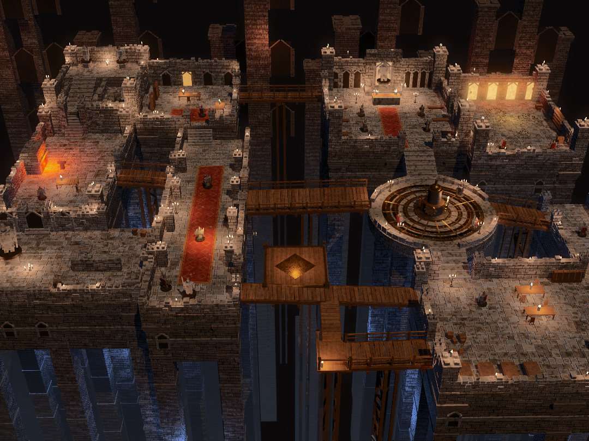
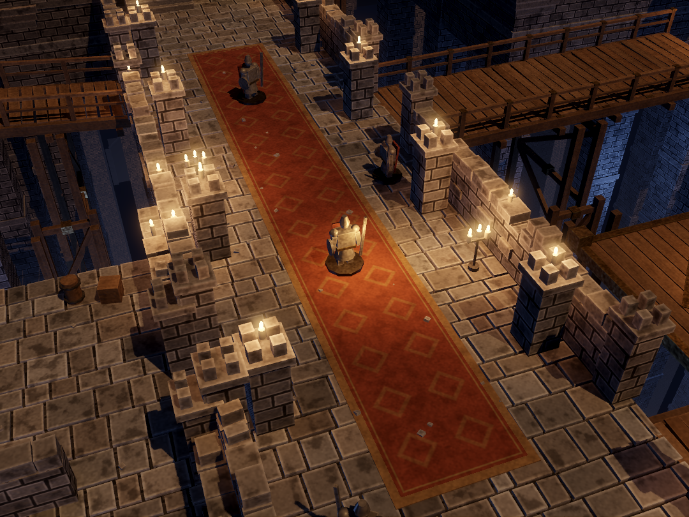

# Abyss Diorama (from-scratch build)

A small explorable game built from scratch to match `reference/reference.png`:
a candle-lit miniature dungeon of rooms on masonry piers above a blue-black
abyss, joined by timber and brass bridges. The game shares no code or assets
with the original game in `src/`, `godot/` and `godot_bridge/`, and it is
measured with the repository's own `tools/`. It is a self-contained Godot 4.7
project made of GDScript and shaders only, with no models or textures; every
stone, plank, candle and figure is generated.



## Run

```sh
godot --path diorama                       # play
godot --path diorama -- --seed=3           # another seed (layout fixed, detail varies)
diorama/tools/capture.sh TAG [--cam=...]   # raw capture, LUT fit, graded capture, score
```

`tools/capture.sh` starts Xvfb when there is no display. On a GPU-less Linux box
install `mesa-vulkan-drivers` so Godot runs Forward+ on lavapipe. Without it,
Godot falls back to the OpenGL Compatibility renderer, which has no SSAO and
caps lights per object.

| Control | Action |
| --- | --- |
| WASD / arrows | Walk the hero (camera-relative) over rooms, stairs, bridges and the lift |
| RMB drag / MMB drag / wheel | Orbit / pan / zoom |
| F | Follow the hero |
| Home / F12 / F1 / F11 | Reset camera / screenshot to `user://` / toggle help / fullscreen |

User args (after `--`): `--seed=N --cam=yaw,pitch,dist,fov,tx,ty,tz --size=WxH
--capture=PATH --frames=N --nohud --lut=off|auto|PATH.cube --strength=0..1`.

## Layout

- `layout.gd`: the authored plan, traced from the reference composition.
  It has ten rooms (gatehouse with dais and stairs, study, forge, long hall,
  ruined statue court, chapel, treasury, barracks with an east landing), the
  round brass mechanism platform, the hanging lift, six bridges (the low one
  meets a timber stair-tower up to the long bridge), and a gothic backdrop
  falling into the abyss.
- `kit.gd`: the building kit. It provides instance batching (one MultiMesh per
  mesh × material), irregular flagstones, ragged masonry walls with proud
  blocks, towers, piers, foundations, stairs, bridges, trestles, chains,
  furniture, candles (with lights), treasure and painted miniature figures.
- `walk.gd`: walkable surfaces (rects, ramps, bridge segments, circles). The
  hero picks the surface closest to its current height, and props block it.
- `lut.gd`, `shaders/grade.gdshader`: `.cube` loader and the full-screen grade.
- `shaders/kit.gdshader`: one procedural material for everything. It has
  modes for carved block (edge highlights from box-edge distance, a
  dry-brushed look), coursed masonry, wood grain, metal, carpet pattern and
  glow. `flame.gdshader` handles the flickering candle flames.

## Measuring

Scoring uses the repository's own `tools/compare.py` and `tools/fit_lut.py`,
unmodified. `tools/match.py` targets the original `godot/` project, so
`diorama/tools/capture.sh TAG` runs the same loop against this project instead:

1. Capture the raw render (LUT off) at the reference size.
2. Fit `luts/00_reference_match.cube` with `fit_lut.py --out`.
3. Capture the graded render in-engine.
4. Score both with `compare.py`.

`RAW_ONLY=1` stops after step 1 and its score.

The game applies the LUT itself (`lut.gd`, `shaders/grade.gdshader`, both
written for this project; `--lut=off|auto|PATH`). The engine's graded capture
matches `fit_lut.py`'s prediction to a mean difference of 0.55/255.
`tools/camfit.py` fits the default camera on the raw score, and
`tools/check.gd` checks walkability.

Scores (seed 7, 1080×810, default camera, against the local reference):

| Stage | Raw | Graded |
| --- | --- | --- |
| Layout, lighting and camera as first committed | 68.4 | 84.6 |
| Abyss and background less blue (the LUT had been warming the shadows) | 76.6 | **85.8** |
| Dead-end low bridge joined to the long bridge by a stair; scaffolds that held nothing removed | 76.4 | 85.7 |

The fitted lightness curve is gentle (0.4→0.44, 0.8→0.74). The remaining
penalty is mostly hue mix (too little pure orange) and local contrast (×0.88
of the reference). Structurally, the reference's masonry is chunkier and more
irregular, and its miniatures and props are far more detailed than these
primitive-built stand-ins.



## Checks

```sh
godot --headless --path diorama --script res://tools/check.gd   # every area reachable from the spawn
```

Neither check catches a bridge that leads nowhere. `compare.py` scores colour
and texture regardless of composition, and a dead end still counts as
reachable. Check connections by eye, for example with a top-down render:
`--cam=0,-89.9,190,20,28,0,20`.
